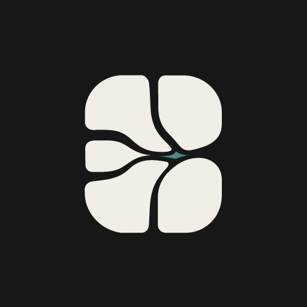

<p align="center">
  <picture>
    <source media="(prefers-color-scheme: dark)" srcset="docs/logo-dark.svg">
    
  </picture>
</p>

<h1 align="center">Conflux</h1>

<p align="center">
  
  
  
  
</p>

<p align="center">
  <b>A supervision desk for many CLI coding agents, running side by side on one canvas.</b><br>
  Like a terminal multiplexer for AI agents — Windows-native, real PTY sessions, and it tells you the moment an agent needs you.
</p>

<p align="center">
  <a href="#english">English</a> · <a href="#中文">中文</a>
</p>

<p align="center">
  <br>
  <sub><i>Demo GIF placeholder — <code>docs/demo.gif</code> (to be added)</i></sub>
</p>

---

<a id="english"></a>

## What is Conflux?

Conflux is a **Windows desktop workbench for running and supervising several real CLI coding agents at once** — Claude Code, Codex, Aider, OpenCode, and other agent CLIs. Each agent runs as a genuine PTY session (ConPTY + xterm.js), laid out as cards on a single canvas.

The problem it solves: once you have three or four agents working in parallel, you can't watch four terminals. Conflux is built so you **don't have to babysit each one** — it surfaces the one that needs you, lets you jump straight to the moment it asked, and keeps a full audit trail of what happened while you were looking away.

It is not another chat UI. Agent work is treated as real sessions, cards, attention signals, permission requests, and a replayable event timeline.

## Why Conflux?

- **Windows-native** — runs directly on ConPTY. No WSL, no Unix compatibility layer. Windows is the primary target, not an afterthought.
- **Many agents, one canvas** — open multiple real CLI agents at the same time; each is a live PTY session rendered through xterm.js, not a mock card.
- **Attention that finds you** — a Dynamic Island, a sidebar, and a system tray route each agent's status to you. For Claude Code sessions the signal comes from an authoritative **hook**, not screen-scraping — so "this one is waiting on you" is a real event, not a guess.
- **Jump back to the exact moment** — click a notification and Conflux takes you straight to the pane and the point in the session that triggered it. No hunting across terminals.
- **Step in without breaking flow** — expand any card to a two-way terminal and type directly into that agent's session, then collapse it back into the grid.
- **You hold the gate** — permission requests from agents surface as an approval UI; nothing runs past a gate you didn't clear.
- **Everything is on the record** — every event is written to a local SQLite store, and the session timeline can be replayed after the fact.

## Install

> Conflux is **Windows-only** and currently at **V1 / early**. There are no prebuilt installers yet — build from source.

### Prerequisites

- Windows 10/11
- [Rust](https://rustup.rs/) (1.77+) and the MSVC toolchain
- [Node.js](https://nodejs.org/) 18+ and npm
- [Tauri 2 prerequisites for Windows](https://tauri.app/start/prerequisites/) (WebView2 is bundled on Windows 11)

### Build from source

```powershell
git clone https://github.com/Verson1daddy/Conflux.git
cd Conflux\conflux-app

npm install
npm run tauri:build      # produces a Windows bundle under src-tauri\target\release
```

### Run in dev

```powershell
cd Conflux\conflux-app
npm install
npm run tauri:dev
```

## Quick start

1. Launch Conflux.
2. Add an agent — pick its CLI (Claude Code / Codex / Aider / OpenCode) and a working directory. Conflux spawns it as a real PTY session and drops a card onto the canvas.
3. Add a few more. Let them run. Watch the **Dynamic Island** and **tray** instead of the terminals.
4. When one needs you, the notification points at it — click to **jump back** to that pane and the exact moment.
5. Expand its card to type into the session directly, approve or reject any permission request, then collapse it and move on.

## Features

- **Multi-agent canvas** — several live CLI agents as cards you can arrange, expand, and collapse.
- **Real PTY sessions** — ConPTY-backed processes rendered with xterm.js, with full ANSI/color fidelity, not read-only mockups.
- **Attention routing** — Dynamic Island + sidebar + system tray surface which agent needs attention. Claude Code status is driven by an authoritative hook signal, not screen-scraping.
- **Semantic jump-back** — notifications carry a location; one click returns you to the pane and moment that triggered them.
- **Two-way intervention** — expand a card into an interactive terminal to steer an agent mid-run.
- **Permission approvals** — agent permission requests surface as a gate you clear before anything proceeds.
- **SQLite event audit + timeline replay** — every event is persisted locally and the session history can be replayed.
- **Broadcast to agents** — the discussion panel lets you send one prompt out to multiple agents at once.
- **Crafted UI** — an Apple-meets-magazine aesthetic with glass surfaces and a considered type system (Fraunces / Geist / JetBrains Mono).

> **Scope note (honest boundaries).** Conflux supervises agents; it does not orchestrate them. The discussion panel is a **one-way broadcast** from you to N agents — agents do **not** reply into a shared chat and do **not** talk to each other. There is **no** automatic task-orchestration engine that decides work on its own. The attention layer surfaces through a two-state Dynamic Island, a sidebar, and the system tray (Float Ball is not part of it). You stay the decision-maker in the loop.

## Architecture

Conflux is a two-layer workspace:

- **`conmux`** — a standalone Rust crate: the Windows terminal-multiplexing + agent-isolation runtime (ConPTY, PTY session management). No Tauri dependency.
- **`conflux-app`** — the Tauri 2 + React product layer (canvas, attention surfaces, permission UI, audit/timeline) built on top of `conmux`.

## Configuration

Agent CLIs are configured through adapters (Claude Code, Codex, Aider, OpenCode), each with its own command, arguments, and working directory. Configuration lives with the app; the ergonomics are still evolving in V1 — expect this surface to change.

## Status & roadmap

Conflux is **V1, Windows-only, and early**. It is a working workbench, not a finished product.

- Prebuilt / signed installers
- Broader adapter coverage and easier adapter configuration
- Hardening of the attention and permission layers
- Timeline / audit UX polish

Feedback and issues are welcome — this is the stage where they shape the product most.

## About & contributing

Conflux is an open-source project built by a student at **South China Normal University (华南师范大学)**, developed in the open — a genuine attempt to make the multi-agent workflow on Windows better.

There's no budget for a code-signing certificate, so when prebuilt installers ship they'll be **unsigned**: Windows SmartScreen will warn that the publisher is unknown. To run anyway, click **More info → Run anyway** — or skip the installer and build from source (instructions above), since all the code is right here.

Conflux is early and moving fast, and the agent-collaboration side is honestly still a work in progress. If you have ideas, hit a bug, or want to help shape where this goes, please **open an issue or discussion, or send a focused PR** (a quick discussion first helps us point you at the current contracts). I'd genuinely love to build a better Windows agent ecosystem together — come say hi.

## License

Licensed under **MIT OR Apache-2.0** (as declared for the `conmux` crate). A root license file has not yet been committed to this repository — that will land before any prebuilt binaries are distributed.

---

<a id="中文"></a>

## Conflux 是什么

Conflux 是一个 **在 Windows 桌面上并行运行、并统一监管多个真实 CLI 编程 agent 的工作台** —— Claude Code、Codex、Aider、OpenCode 等 agent CLI。每个 agent 都是一个真实的 PTY 会话（ConPTY + xterm.js），以卡片形式铺在同一块画布上。

它要解决的问题很具体：当你同时跑三四个 agent，你没法同时盯四个终端。Conflux 的设计目标就是让你 **不必逐个盯守** —— 它把"现在需要你处理的那个"浮出来，让你一键跳回它当初发问的那一刻，并且在你没看的时候把一切都记进审计。

它不是又一个聊天 UI。Agent 的工作被当成真实的会话、卡片、注意力信号、权限请求，以及一条可回放的事件时间线。

## 为什么用 Conflux

- **Windows 原生** —— 直接跑在 ConPTY 上，不依赖 WSL、不装类 Unix 兼容层。Windows 是首要目标平台，不是顺带支持。
- **多 agent，一块画布** —— 同时打开多个真实 CLI agent，每个都是活的 PTY 会话、由 xterm.js 渲染，而非假卡片。
- **会来找你的注意力路由** —— 灵动岛、侧栏、系统托盘把每个 agent 的状态送到你面前。Claude Code 会话的信号来自权威 **hook**，不是刮屏猜测 —— 所以"这个在等你"是一个真实事件，而不是估计。
- **一键跳回触发处** —— 点通知，Conflux 直接把你带到那个分屏、带到触发它的那个位置。不用在多个终端里翻找。
- **不打断心流地介入** —— 展开任意卡片进入双向终端，直接往那个 agent 的会话里打字，处理完再收回网格。
- **闸门在你手里** —— agent 的权限请求以审批 UI 形式浮现；没经你放行的东西不会往下走。
- **一切留痕** —— 每个事件都写入本地 SQLite，会话时间线可事后回放。

## 安装

> Conflux **仅支持 Windows**，当前处于 **V1 / early**。暂无预编译安装包，请从源码构建。

### 前置要求

- Windows 10/11
- [Rust](https://rustup.rs/)（1.77+）及 MSVC 工具链
- [Node.js](https://nodejs.org/) 18+ 与 npm
- [Tauri 2 的 Windows 前置依赖](https://tauri.app/start/prerequisites/)（Windows 11 已内置 WebView2）

### 从源码构建

```powershell
git clone https://github.com/Verson1daddy/Conflux.git
cd Conflux\conflux-app

npm install
npm run tauri:build      # 产物在 src-tauri\target\release 下
```

### 开发模式运行

```powershell
cd Conflux\conflux-app
npm install
npm run tauri:dev
```

## 快速上手

1. 启动 Conflux。
2. 添加一个 agent —— 选它的 CLI（Claude Code / Codex / Aider / OpenCode）和工作目录。Conflux 把它作为真实 PTY 会话拉起，并在画布上放一张卡片。
3. 多加几个，让它们跑。盯 **灵动岛** 和 **托盘**，而不是盯终端。
4. 当某个需要你，通知会指向它 —— 点一下 **跳回** 到那个分屏、那一刻。
5. 展开卡片直接往会话里打字，批准或拒绝权限请求，然后收起，继续下一件事。

## 功能

- **多 agent 画布** —— 多个活的 CLI agent 以卡片呈现，可排布、展开、收起。
- **真实 PTY 会话** —— ConPTY 支撑的进程，由 xterm.js 渲染，完整 ANSI/配色，不是只读样稿。
- **注意力路由** —— 灵动岛 + 侧栏 + 系统托盘浮现哪个 agent 需要处理。Claude Code 状态由权威 hook 信号驱动，非刮屏。
- **语义 jump-back** —— 通知携带位置信息，一键回到触发它的分屏与时刻。
- **双向介入** —— 展开卡片进入交互式终端，运行途中直接操控 agent。
- **权限审批** —— agent 的权限请求以闸门形式浮现，放行后才继续。
- **SQLite 事件审计 + 时间线回放** —— 每个事件本地持久化，会话历史可回放。
- **广播给 agent** —— 讨论面板可把一条 prompt 一次发给多个 agent。
- **考究的界面** —— 苹果 × 杂志风、玻璃质感，配合成体系的字体（Fraunces / Geist / JetBrains Mono）。

> **边界说明（老实话）。** Conflux 监管 agent，但不编排它们。讨论面板是从你到 N 个 agent 的 **单向广播** —— agent **不会** 把回复汇进一个共享聊天室，**不会** 彼此对话。**没有** 自动决定任务的编排引擎。注意力层由两态灵动岛、侧栏与系统托盘构成（Float Ball 已删，不在其中）。决策权始终在你手里。

## 架构

Conflux 是两层结构：

- **`conmux`** —— 独立 Rust crate：Windows 终端多路复用 + agent 隔离运行时（ConPTY、PTY 会话管理），不依赖 Tauri。
- **`conflux-app`** —— 基于 `conmux` 的 Tauri 2 + React 产品层（画布、注意力面、权限 UI、审计/时间线）。

## 配置

Agent CLI 通过适配器配置（Claude Code / Codex / Aider / OpenCode），各有自己的命令、参数与工作目录。配置随应用存放；V1 阶段这块手感仍在演进，预期会变。

## 状态与路线

Conflux 目前 **V1、仅 Windows、early**。它是一个能用的工作台，而非成品。

- 预编译 / 签名安装包
- 更广的适配器覆盖与更简单的适配器配置
- 注意力层与权限层的硬化
- 时间线 / 审计体验打磨

欢迎反馈与 issue —— 现在正是最能影响产品走向的阶段。

## 关于与共建

Conflux 是**华南师范大学**一名学生做的开源项目，在开放中开发——想认真地把 Windows 上的多 agent 工作流做得更好一点。

目前没有预算购买代码签名证书，所以预编译安装包上线后会是**未签名**的：Windows SmartScreen 会提示"发布者未知"。运行方法是点 **更多信息 → 仍要运行**；不放心的话，也可以不用安装包、直接从源码构建（步骤见上文）——所有代码都在这里。

Conflux 还很早、迭代很快，说实话 agent 协作那一块也仍在打磨中。如果你有想法、遇到 bug，或者想一起塑造它的方向，欢迎 **提 issue、开 discussion 或发一个聚焦的 PR**（大改动前先开个 discussion，方便我们把当前契约指给你）。我真心希望能和大家一起，把 Windows 上的 agent 生态做得更好——欢迎来打个招呼。

## 许可

采用 **MIT OR Apache-2.0**（如 `conmux` crate 所声明）。仓库根目录尚未提交 license 文件 —— 在分发任何预编译产物之前会补上。
